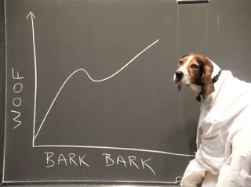

# API using a trained model for ML inferences.

-----------------------------------

This Fask API receives and delivers a json to infer the *Actual Time of Arrival* of a flight once it reaches the *Flight Information Region* of our destination airport. 

This project, consisted of:

- Studying the domain knowledge of commercial/private flights.
- A lot of processing with Pandas.
    - Ingest several parquet tables.
    - Many joins.
    - Datetime pains: Transforming *str* to *datetime* and *numerical*, undoing the processes at the end.
    - Categorical features to numerical with 1-hot encoding, undoing it.
- Creating a ML model.
- Exporting it to use in an API (in *json_folder* there is an example of how using this API, once it is running).

I am not allowed to publish the used data, so unfortunately I can not describe the data processing section with a Jupyter or similar.

## Content.

Click to expand.

- src:
    - main.py* starts the API. It uses the *ata_fir.py* script.
    - *ata_fir.py* was meant to be the main script, but it was recycled as function to be used by this API.
    - *requirements.txt* 

- output:
    - The trained model and standarization weights for the test set.

- json_folder:
    - Example of how using the API through terminal.
    - The template. Input data will be transformed to match that json (transforming categorical features to numerical with 1-hot enc).

    

-------------------------

## Input data.

Click to expand.

This scripts receives a json of meteorological and scheduled parameters and delivers the ATA.

- It has to be initiated when the flight reaches the airport FIR space.
- At that time, meteorological parameters will be included in the json (in the Jupyter, there is the process of how using *merge_asof* to associate the *entry FIR time* with the given meteorologial conditions, updated every 30 minutes).

- The input json must be **included** in the API call (explained later) with at least, the following parameters and one of the available options:
    - requested_fl float64
    - adep_latitude float64
    - adep_longitude float64
    - icao_flight_type: {'N', 'S'}
    - market_segment: {'Charter', 'Lowcost', 'All-Cargo', 'Business Aviation', 'Traditional Scheduled'}
    - airTemp_C float64
    - dewPoint_C float64
    - relativeHumidity_pct float64
    - windDirection_deg float64
    - windSpeed_kts float64
    - altimeter_hPa float64
    - visibility_m float64
    - skyc1_okt: {'NSC', 'unknown', 'OVC', 'FEW', 'NCD', 'VV ', 'SCT', 'BKN'}

- **filed_arrival_time** & **actual_entry_time** datetime64[ns] => Currently not used due to overfitting problems, but there is a function to transform the str json into int64 and work with it. It was the goal from the beginning.
    

-------------------------

## How to use.

Click to expand.

- Download it and navigate to the folder.
- To initiate the API:

        python3 src/main.py

- Open another terminal and execute a command with the required json params. In *json_folder/server_order.txt* is available this one:

        curl -H "Content-Type: application/json" -X GET -d '{"requested_fl":424.2,"airTemp_C":4.2,"adep_latitude":42.4242,"adep_longitude":-42.4242,"dewPoint_C":4.42,"relativeHumidity_pct":4.4242,"actual_entry_time":"2021-05-11 00:04:02","filed_arrival_time":"2021-05-11 04:42:42","icao_flight_type":"N","market_segment":"Traditional Scheduled","station":"EGLL","windDirection_deg":424.2,"windSpeed_kts":42.0,"altimeter_hPa":4422.42,"visibility_m":424242.42,"skyc1_okt":"SCT","feel_C":7}' http://127.0.0.1:5000/  

To sum up: 

        GET instructions + 'json' + port.

-----------------------------------

## Achievements.

Click to expand.

- Delivering a project with short deadline and no domain knowledge.
- Reinforcing Pandas practices.
- Real case of using *pickle* to save trained models.
- Learned Flask basics.
- Built the pipeline.
- The API is running.
- It infers the ATA when an aircraft enters the wanted FIR.

-----------------------------------

## To improve.

Click to expand.

- 60% of time was employed on analyzing dataframes and looking for info on the internet regarding their nomenclature and nature.
- 5-10% was used to analyse a possible ML model. A minimal change of columns resulted in overfitting. Running out of time, I could not find a better approach to feature selection.
- Rest: Flask and refactoring from the Jupyter Notebook.

- More detours than expected working with *datetimes*. It was a sink of time and at the end, I chose as input data a *json*, which only works with *str*, *int* and *float*, so a great part of my *datetime* work was useless. Regarding this, a more efficient way needs to be implemented.
- Regression: Is not good.
    - Not enough time to make it as good as it should be.
    - More problems with *datetimes* columns. After solving them, using this beloved features the result was always overfitting, so I had to discard them in order to deliver a solution in time.
    - Feature selection not good enough. Lack of time.

- The whole project is based on the following: 

    In dataframes, columns with suffix *actual* means *what really happened, once the flight arrived*, and *filed* means *what was scheduled to happen*. 

    Nevertheless I assume that when an aircraft enters the **FIR**, I can request *actual* columns. They reach the **FIR**, we are noticed, so we can use the *real entry time* as target. 

-----------------------------------
-----------------------------------

## Concusions.

Click to expand.

Being my first project flights-related, I made a lot of detours, way more than I wanted. Nevertheless I have to admit I felt this days passionate about having in front of me a challenge understandable enough to work on it and hard enough to learn a lot in the way, more than expected, and I love that.

*The impediment to action advances action. What stands in the way becomes the way*. 

Marcus Aurelius

----------------------------

**https://www.linkedin.com/in/alberto-vargas-pina/**

For an automated project in Google Cloud Platform, trained and served weekly, here's the link:

**https://github.com/albertovpd/automated_ML_regression**

-----------------------------

-----------------------------------
-----------------------------------
